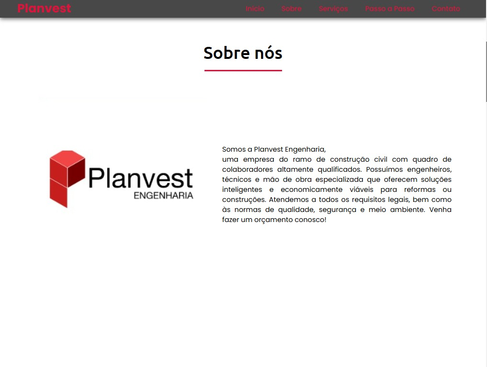
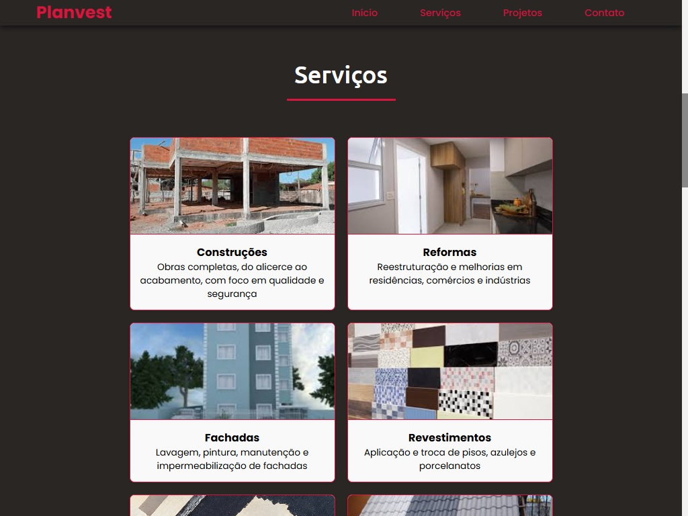
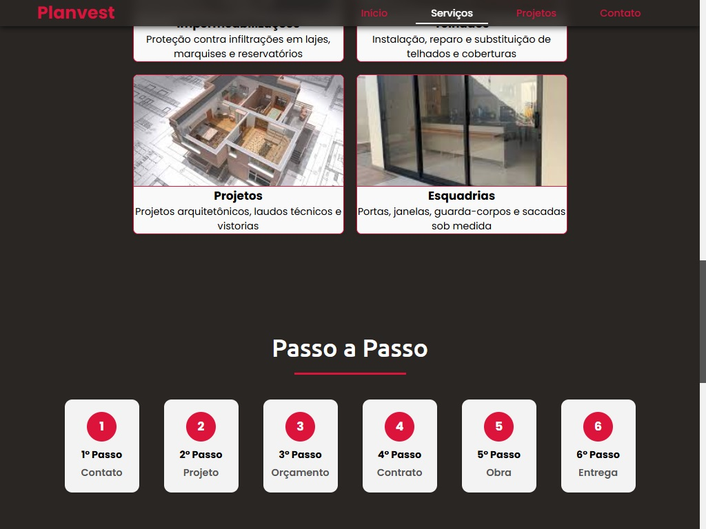
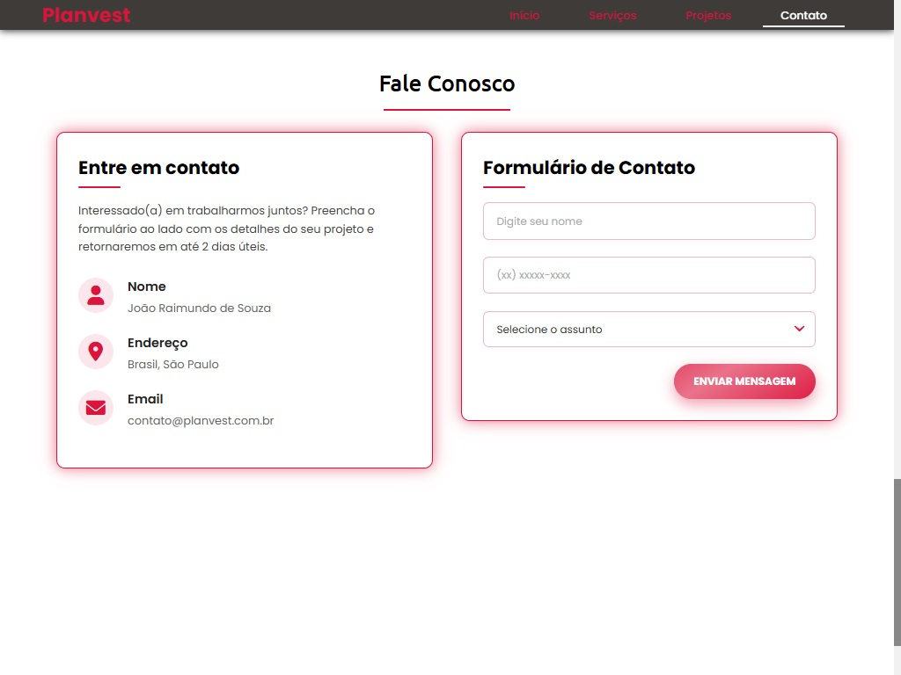

# Meu Site

Site simples feito em HTML, CSS e JavaScript.

## Como usar

Basta abrir o arquivo `index.html` no navegador.

## Tecnologias

- HTML
- CSS
- JavaScript

## Capturas de Tela

### Página Inicial
Visual da seção inicial do site, com o nome da empresa e menu de navegação.

### Seção Sobre

### Seção Serviços

### Seção Passo a Passo

### Seção Contato

